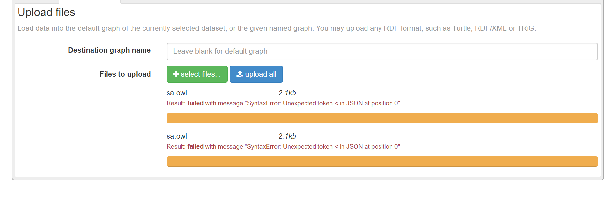

# API Ontology Pizza

Esta API se encargara de captar los parametros (tokens) y de formular las querys para enviar a DB Fuseki

### Reference Documentation Spring Boot
For further reference, please consider the following sections:

* [Official Apache Maven documentation](https://maven.apache.org/guides/index.html)
* [Spring Boot Maven Plugin Reference Guide](https://docs.spring.io/spring-boot/docs/2.3.12.RELEASE/maven-plugin/reference/html/)
* [Create an OCI image](https://docs.spring.io/spring-boot/docs/2.3.12.RELEASE/maven-plugin/reference/html/#build-image)
* [Spring Web](https://docs.spring.io/spring-boot/docs/2.5.2/reference/htmlsingle/#boot-features-developing-web-applications)

### Guides
The following guides illustrate how to use some features concretely:

* [Building a RESTful Web Service](https://spring.io/guides/gs/rest-service/)
* [Serving Web Content with Spring MVC](https://spring.io/guides/gs/serving-web-content/)
* [Building REST services with Spring](https://spring.io/guides/tutorials/bookmarks/)

### BD Fuseki
Descarga el .zip de Apache Jena Fuseki
* [Link download](https://jena.apache.org/download/)

Install
Sugerencia: Descomprimir el archivo en el disco :/C

Dentro de la carpeta descomprimida ejecuta Apache Fuseki
```
fuseki-server --update --mem /ds
```
/ds sera el nombre de la base

Cargo la Ontologia OWL en la seccion de Upload files
    

Cabe recalcar que la variable serverUri es igual a
```
String serviceUri="http://localhost:3030/ds";
```